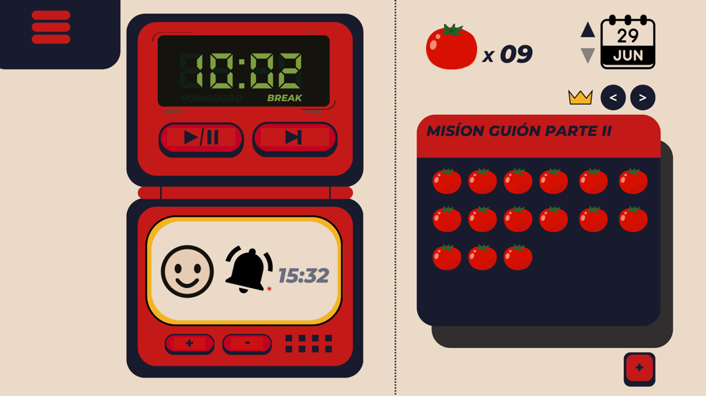

# PomoTempo

**PomoTempo** es una aplicación de productividad diseñada para ayudarte a organizar tus descansos y mejorar la gestión del tiempo, especialmente en proyectos creativos. Esta herramienta permite visualizar y registrar el progreso de tus prototipos y proyectos artísticos, dándoles un significado y estructura claros.

## 🚀 ¿Qué es PomoTempo?

PomoTempo funciona como un temporizador Pomodoro, donde puedes establecer misiones para cada actividad. A medida que completas cada pomodoro, puedes registrar tu progreso, lo que te permite llevar un seguimiento detallado de tus avances.

## 🎮 Dinámica

- **Modo Pomodoro**: Utiliza PomoTempo como un temporizador para gestionar tus sesiones de trabajo. Al final de cada sesión, registra la tarea que realizaste como una misión completada.
- **Registro de Misiones**: Define y rastrea misiones personalizadas para cada actividad o proyecto en el que trabajas, y observa tu progreso a lo largo del tiempo.

## 🛠️ Tecnología

- **Motor de juego**: Godot 4.3
- **Backend**: ASP.NET Core
- **Base de datos**: SQL Server

PomoTempo está diseñado con Godot 4.3 para ofrecer una experiencia fluida y eficiente, mientras que el backend en ASP.NET Core maneja la lógica del servidor y la gestión de datos.

## 📦 Prerelease

Puedes descargar la versión prerelease de PomoTempo en [itch.io](https://esculpiendojuegos.itch.io/pomotempo) y empezar a gestionar tus proyectos artísticos de manera más organizada.

